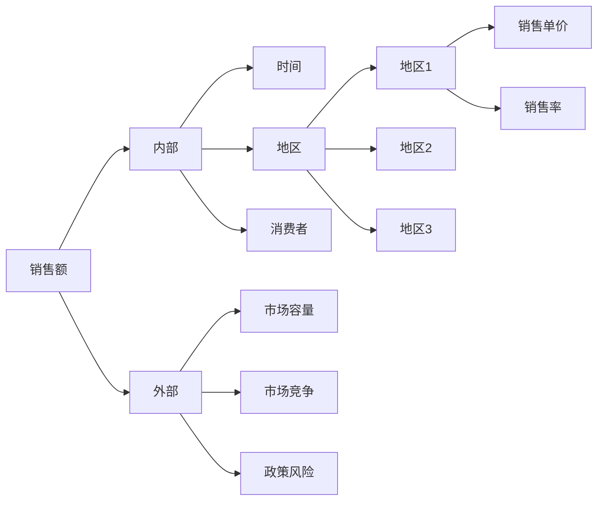
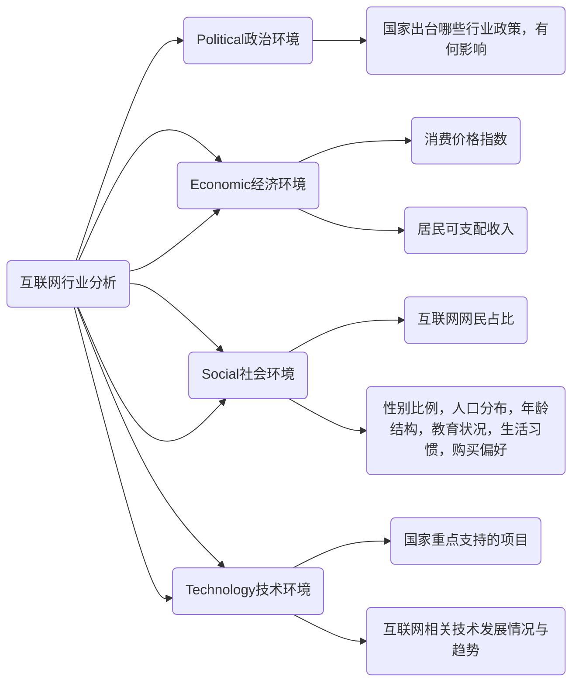
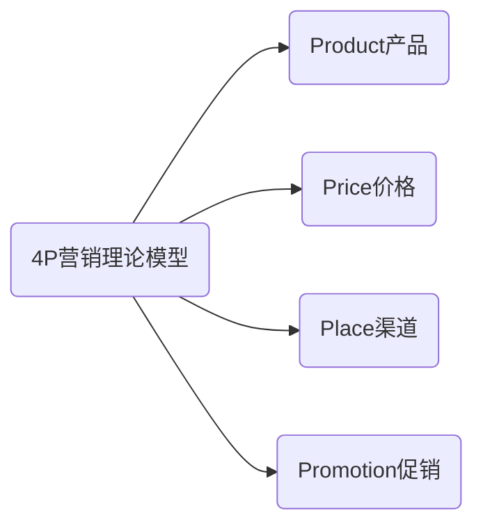
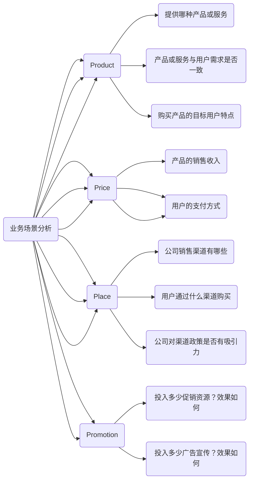
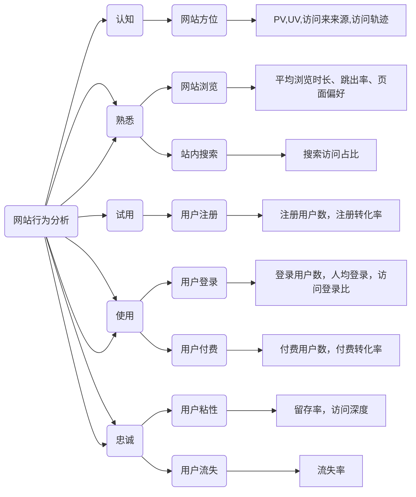
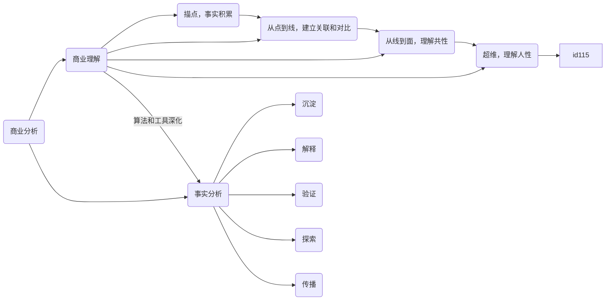

本文整理摘录自知乎问答：



以下内容摘自 

原文作者：@李启方
原文出处：知乎
原文链接：https://www.zhihu.com/question/20603837/answer/560150921


# 什么是商业分析


**wiki:**
商业分析，是识别业务需求和确定业务问题解决方案的研究学科。 通常包括战略规划、流程改进、组织变更、以及通过数据分析等手段来研究解决问题。


<!--more-->

# 如何培养商业分析能力

## 培养结构化思维

### 什么是结构化思维

结构化思维其实就是把复杂问题分解成<span id="inline-purple">多种</span><span id="inline-green">单一</span>因素的过程。 然后将这些因素加以归纳整理，使之纲领化。

### 如何培养结构化思维

<span id="inline-yellow">金字塔模型</span>

任何事情都可以归纳出<span id="inline-blue">中心论点</span>， 由中心论点出发，可由三至七个<span id="inline-blue">论据支撑</span>。 每个一级论点可以衍生出其他分论点。 

#### 如何搭建金字塔模型

1 尽可能列出所有思考的要点
2 找出关系，进行分类
原则是<span id="inline-blue">论点</span>相互<span id="inline-green">独立，不重叠</span>；<span id="inline-blue">论据</span><span id="inline-green">穷尽划分，不遗漏</span>。


**自己需要提高的点**

1 尽可能列出所有思考的点 

这一点自己的方法基本是依靠个人的直觉找点。 个人直觉应当继续保留。 惊奇的发现有时候就是来源于一时的灵感而并不总是套路。 但同时，还需要了解一些常用的思考方向有哪些。 原因是灵感不是时时都有，且仅依赖于灵感找的点不一定全。 所以结论，补充<span id="inline-blue">思考框架</span>。 

2 找出关系，进行分类

这点在自己的思维里是没有的。 原因，之前的经验里，一般是已经拿到了现成的已量化的各类数据，所以注意力和重点都在如何利用这些数据建模上。 所以一直忽略了这一步。 而在即使没有现成特征的情况下，自己的解决方式是通过找到很多认为有关的特征即可。 不需考虑特征间的关系。 如果涉及需要将特征分类或给出特征对因变量影响强弱，只需要找到合适的模型，即可通过模型将特征分类或得到特征对因变量的影响强弱。 如果仍然涉及分析特征间关联关系，也有对应的方法可以实现。 另一方面是，从对特征的认知上，认为特征很多时候是普遍存在关联的，而关联关系，尤其是复杂的关联关系，并不是人可以获得的。 虽然，模型获得的也并不一定是正确的。 但更多时候，会选择依赖模型给出关系。 因此，从之前的角度来讲，认为自己处理的并不是相互独立的并且可拆分的单一因素，而是一张交错的关系网。 这一点，与结构化思维的拆分要求有着很大的不同。

但两者之间，其实并不矛盾。 在自己寻找特征的时候，可以是有结构的，也可以对特征进行分类思考。 即可以利用这种思维的结构帮助自己筛选特征。 




##### 举例

【问题】现在有一个线下销售的产品。我们发现8月的销售额度下降，和去年同比下降了20%。 找原因

1 尽可能列出所有思考的点

想先观察时间上的波动。 看是突然暴跌还是逐渐下降
分不同的地区看一下差异，是不是有区域因素 
我也准备问几个销售员，看一下现在的市场环境怎么样，听说有几家竞争对手也缩水了，是不是这个原因

2 (结构化梳理)找出关系，进行分类



##### 思考框架总结

###### 5W2H分析法 

5W2H分析法主要针对5个W以及2个H提出的7个关键词进行数据指标的选取，根据选取的指标进行分析。

```mermaid 
graph LR
	id1(用户行为分析) --> id11(WHY)
	id1 --> id12(WHAT)
	id1 --> id13(WHO)
	id1 --> id14(WHEN)
	id1 --> id15(WHERE)
	id1 --> id16(HOW MUCH)
	id1 --> id17(HOW)
	id11 --> id111(用户购买目的是什么)
	id11 --> id112(产品有哪些地方能吸引用户)
	id12 --> id121(产品是什么)
	id12 --> id122(是否和用户需求一致)
	id13 --> id131
	id13 --> id132(用户的特点(用户画像))
	id14 --> id141(用户什么时候购买)
	id14 --> id142(用户购买的频率)
	id15 --> id151(用户购买的成本)
	id16 --> id161(用户如何购买)

	style id11 fill: #5cb85c
	style id12 fill: #5cb85c
	style id13 fill: #5cb85c
	style id14 fill: #5cb85c
	style id15 fill: #5cb85c
	style id16 fill: #9954bb
	style id17 fill: #9954bb
```
## 假说演绎思维

以情况为起点的推理方法是归纳推理，以规则为起点的推理方法可以称之为演绎推理。


### 举例 

【问题】 某电商，现想将商品提价，分析下销售额会有怎样的变化

首先可以确定销量会下降，那么下降多少？ 这里假设商品流量情况，提交后转化率的变化情况，然后根据历史数据汇总出销量下降的情况，从而得出销售额的变化情况。

```mermaid 
graph LR
	id1 --> id11(销量)
	id1 --> id12(单价)
	id12 -- 降低-- > id11 
	id11 --> id111(流量)
	id11 --> id112(转化率)
	id112 --> id1121(用户)
	id1121 --> id11211(忠诚用户)
	id1121 --> id11212(普通用户)
	id1121 --> id11213(羊毛党)
	id12 --降低--> id112 
	id12 --高--> id11211 
	id12 --低--> id11212 
	id12 --无感--> id11213
```
具体的变化情况都可以根据过往的数据来拟合，统计学上也有一些科学的预测模型。

假设先行就是以假设作为思考的起点，先提出问题，然后用<span id="inline-purple">MECE原则</span><span id="inline-green">梳理关联因素间的结构关系</span>。

在实际情况中，可针对不同的项目要求进行组合应用。在经过一定阶段的训练后，可以帮助提升业务熟悉程度，完成业务的初始积累后，后续的分析过程中就可以逐步减少拓展推理的层级及组合，逐步提升问题原因定位的效率。



## 常用的商业分析模型

拥有了科学的思维能力之后，在结合商业场景/问题来分析，可以应用现成的商业分析模型，比如PEST、4P营销理论等，通过这些商业分析模型的训练，能帮助快速完成商业感的积累，完成原始业务逻辑积累。 在此基础上快速定位业务问题，提升分析效率。

### PEST分析模型 

```mermaid 
id1(PEST分析法) --> id11(Political政治环境)
id1 --> id12(Economic经济环境)
id1 --> id13(Social社会环境)
id1 --> id14(Technology技术环境)
```

#### 政治环境

国家的社会制度，执政党性质，政府的方针、政策、法令等。不同的政治环境对行业发展有不同的影响


**关键指标**
政治体制，经济体制，财政政策，税收政策，产业政策，投资政策，专利数量，国防开支水平，政府补贴水平，民众政治参与度


#### 经济环境
宏微观。

宏观： 国家国民收入，国民生产总值以及变化情况，以通过这些指标反应国民经济发展水平和发展速度
微观： 所在地区的消费者收入水平、消费偏好、储蓄情况、就业程度等因素，这些因素决定着企业目前以及未来的市场大小。


**关键指标**
GDP及增长率、进出口总额及增长率、利率、汇率、通货膨胀率、消费价格指数、居民可支配收入、失业率、劳动生产率


#### 社会环境
一个国家或地区的居民受教育程度和文化水平、宗教信仰、风俗习惯、审美观点、价值观等。

文化水平营销居民的需求层次，宗教信仰和风俗习惯会禁止或抵制某些活动的进行；
价值观会影响居民对组织目标和组织活动存在本身的认可；
审美观点则会影响人们对组织活动内容、活动方式以及活动成果的态度


**关键指标**
人口规模、性别比例、年龄结构、出生率、死亡率、种族结构、妇女生育率、生活方式、购买习惯、教育状况、城市特点、宗教信仰状况等因素


#### 技术环境
企业所处领域直接相关的技术手段发展变化，国家队科技开发的投资和支持重点。 该领域技术发展动态和研究开发费用总额，技术转移和技术商品化速度，专利及其保护情况。


**关键指标**
新技术的发明和进展、折旧和报废速度、技术更新速度、技术传播速度、技术商品化速度、国家重点支持项目、国家投入的研发费用、专利个数、专利保护情况。



#### 举例




### 4P营销理论模型



#### 产品 

能提供给市场，被人们使用和消费并满足人们某种需求的任何东西，包括有形产品、服务、人员、组织、观念和它们的组合。

#### 价格 

购买产品时的价格，包括基本价格、折扣价格、支付期限等。影响价格的主要因素有需求、成本和竞争。

#### 渠道

产品从生产企业流转到用户手上全过程所经历的各个环节。

#### 促销 

企业通过销售行为的改变来激励用户消费，以短期的行为促进消费的增长，吸引其他品牌用户或导致提钱消费来促进销售增长。



#### 举例





### 用户行为模型

用户行为指用户为获取、使用产品或服务采取的各种行动。 首先要认知熟悉，然后试用，再决定是否继续消费使用，最后成为产品或服务的忠实用户。



行为轨迹： 认知->熟悉->试用->使用->忠诚





### 小结

PEST主要针对宏观市场环境进行分析，从政治、经济、社会以及技术四个维度对产品或服务是否适合进入市场进行数据化的分析，最终得到结论，辅助判断产品或服务是否满足大环境
4P营销理论模型主要用于公司或其中某一个产品线的整体运营情况分析，通过分析结论，辅助决策近期运营计划与方案
用户行为分析模型应用场景比较单一，完全针对用户的行为进行研究分析。



### 另一个基础模型


作者：同学刘
链接：https://www.zhihu.com/question/20603837/answer/350257155
来源：知乎


商业分析，从数据分析的角度来谈，则是通过数据驱动业务，那作为一名数据/商业分析师，很多时候的困扰是面对很多数据、场景，我要从哪个点切入找到价值点呢?

面对新行业时，只要你愿意，可以有无数细节让你发现，没有定义清自己的目的就陷入无数的数据或是场景中，回过头来做的一系列分析或许都不在我们的业务边界里面。当你陷入细节或者数据的噪音，后面所做的事情都只是在噪音中优化了。

**所以第一步，先不要这么快陷入细节，站在足够高的视野，看清系统的整个流动。**

如果你很有经验，那么或许你很快就能找到问题所在，在面对一个新行业，或是不了解的业务时，我们也可以通过使用这个模型梳理清楚。价值点并不会凭空的出现，通过下面的这个模型，**可以快速的帮你理清你所面对的业务流程是怎样的，进而找到解决问题的切入点。**



**炒鸡蛋例子**




把例子转换为通用描述：



很多的业务流程不一定是有反馈机制的，同时如果只关注反馈信息时会让我们忽略很多更容易实现的因素


当你已经基本梳理清楚你所面对的业务流是怎么样的，你可以向这个业务流发问：如果我们没有达到理想的业务目标，那到底是哪个环节出现了问题？咦，此时你不是已经知道该从哪个点进行切入了吗？那接下来就是大家专业表演的时间，用你懂得的数据，你懂得的商业模型来给出改善这个问题的方案/答案。

总结一下：

1 通过模型梳理清楚你所面临的业务流程是怎样的

2 定义清晰的业务边界

3 根据流程，梳理清晰这个流程中的输入和输出分别是什么

4 向你所梳理的这个业务模型发问，它现在还没有达成目标的原因是出于哪个流程

5 聚焦一个或几个你所发现的问题，给出解决方案

### 三句话总结


作者：秦路
链接：https://www.zhihu.com/question/20603837/answer/133764469
来源：知乎


我将商业分析简单抽象出三层，每一层都有对应的含义：营、盈、赢 。而每一个字的核心思想也就一句话。

#### 营

**让更多的用户在更长久的时间内以更频繁的次数购买更昂贵的商品。**

第一层的分析是商业经营模式的分析，这是商业经营的本质。 任何企业、组织和产品都逃离不出这套框架的四个维度。你可以发展和引申它，但不能减少它。

商业模式的靠谱与否，至少需要满足四个条件中的一个。 如果一种商业即没有用户，又没有长久的消费动力和频次，人们还不肯花钱。这种商业模式还是趁早死了吧。

换言之，如果商业想要发展，就需要往四种方向中的一种或两种靠拢。


##### 更多的用户

更多的用户，衡量的是市场体量和大小。 这个商业模式好不好，第一个指标就是用户量或潜在用户量。 堪称商业模式的金线标准。

用户从哪里来，用户到哪里去，用户是谁？

用户能从微博微信、应用商店、搜索引擎、新媒体等地方来。

用户是谁？用户有潜在用户，有普通用户，有忠诚用户，有流失用户；有竞争对手的用户，有细分市场用户，有核心用户。

用户的质量和数量等同重要，商业希望有更多的用户，这没错，更希望用户是目标用户。 

用户到哪里去，就是让用户完成你预定设立的目标。超市最有价值的用户是站在收银台的用户。 甚至以更严格的定义要求自己的用户，而不是注册、安装、打开等简单流程。

##### 更长久的时间

更长久的时间，衡量的是用户生命周期（使用产品时间服务）。 在互联网领域，对应用户留存率。

#### 更频繁的次数

更频繁的次数，衡量的是用户的消费需求。不同的商业场景下，消费频次肯定不相同。

消费频次分为刚性频次和弹性频次。 一辈子基本只有一次，任你市场营销再牛逼，婚姻类的商业变现也就一次机会。

弹性频次则是相反，由用户自身的意愿决定。快到一天一次，慢到一月一次。购物、出行、社交都是弹性频次。

#### 更昂贵的商品

广告就是一种新的商业形态。无论用户点不点击，曝光了，就产生了商业价值。在更昂贵商品的维度中，不同领域有很多相关指标描述其价格或价值，客单价、ARPU、CPC等。

用户量，生命周期，消费频次，都是为这第四个维度所做的铺垫，就是从用户身上掏出钱。

价格可以很低，比如广告点击，比如佣金抽成。哪怕零点几元，也是定义出了价格。有价格就有收入，就能增长，就能改进。 不论价格是什么形式，它都说商业最基础的因素。


互联网行业有一种固定的思维模式，先获得足够的用户量，再培养用户习惯（忠诚度），最后思考商业变现。 很多企业都倒在最后一步，变现乏力甚至无法变现。实际四个维度并不是层层递进，没有因果关系。换一种方式思考，就是产品没有价格这一因素。


举例说明：小区门口有一家老王烧饼铺，生意兴旺。假设你是一位商业分析师，你会怎么分析老王的烧饼铺呢？


老王的烧饼铺，用户和客流是受地理因素影响的，辐射地就是小区周围，也就是说客源有限。烧饼这种早餐，不管小区爷爷奶奶还是白领，每天早上都可能购买，对吧，满足高频的要求。只要老王的烧饼味道好，小区住户们不会排斥，那么忠诚度能保证。更昂贵的价格？对不起，烧饼真的很难卖贵。

老王拥有的优势是高频和长久，劣势是客源和客单价。再深入想一想，应该怎么解决客源的问题？为了获得更多的客户，开分店可不可行？越多的分店意味着辐射更多的地区，那么客源，以及潜在客源，就上升了。

我们从互联网的角度去思考，哪里有更多的用户？那就是拥有流量入口的几款APP了。用公众号推广？用大众点评吸引用户？加入O2O平台？这些都是方法，靠谱与否就需要深入分析了。


基于四维度框架思考，实际上，很多成熟的商业模式，或者商业工具，都是为四维度服务的。

甚至很多商业模式，会进行维度的转换，牺牲一个维度换取另外一个维度的数据提升。

沃尔玛的薄利多销，牺牲更昂贵的价格，换取用户更高频次以及更长久的消费。

四维度我赋予了一个很重要的特性，它们都是可以量化的，是指标。用户量，价格，生命周期等，都是能作为数据分析，被观察，被对比。 这是四维度的价值所在。 如果你不能衡量它们，就不能增长。 这就是“更”的含义。

在框架上加入商业的数据，以数据的角度去分析，这是衡量分析能力的分水岭。

#### 盈

**用更高的效率以更低的成本抢占更多的市场并且更好地满足用户需求**

这一层不限于经营模式，而是管理模式。

第一层的四个维度，并不能帮助商业模式活下来和活得久。因为企业需要盈利，第一层框架对应的只是GMV, 而不是利润。

第二层框架，就是商业管理框架，我们不仅要经营商业，还要能管理商业、控制商业。 中国老话说得好，第一层用来发江山，第二层是守江山。

### TTPPRC

以下内容摘自 

原文作者：@JOIN于宙
原文出处：知乎
原文链接：https://www.zhihu.com/question/20603837/answer/47073613


#### Trend(趋势) 

与其费尽心思解读为什么会有这样的趋势，不如时刻留心趋势的变化，紧随时代的潮流的。 绝大多数商业项目在这一环的关键原则，是不犯大错误。

#### Traffic(流量)

无论你想卖什么东西，先得让人知道你在卖呀。 在TTPPRC中，我把流量（Traffic）简单定义为，**让目标客户了解到他们有这么一个消费选择。** 而其中最重要的四个字就是，目标客户。 YY平台上的在线语音视频的惊人流量拓展到在线教育上一塌糊涂，显然玩网络游戏和看美女跳艳舞的YY用户，不会摇身一变成坐在电脑前花钱上课的上进青年；人流最大的商场适合优衣库但不适合香奈儿；你永远都不会在电视上看到劳斯莱斯的广告。 流量（Traffic）是否有效，还要具体问题具体分析。 

流量（Traffic）不是万能的，它和六步模型中的下一步包装（Package）紧密相连，再优质的流量，如果你的商业项目包装不好也是白费。

强势品牌可以自发的导入流量（Traffic）。

不同的商业项目对流量（Traffic）的具体需求大不相同，一般而言，越是标准化高可替代性高的业态，流量这个环节在整个生意上就越重要。

目标客户是企业而非大众消费者的（B2B和C2B），决定流量（Traffic）的是销售团队的力量。 移动互联网是当下的流量（Traffic）之王。 演艺公司远在互联网时代来临之前就懂得炒作的重要性，只因他们的生意对于大众流量的需求实在是太高了。 

99%的互联网创业注定尸骨无存的原因不用太复杂的分析，流量（Traffic）这关根本就过不去。 

归根结底，一个商人商业能力的高低的首要标准，就是看他能为自己的生意导入多少流量（Traffic）。 无论是老一辈企业家为了拿下一个单子在酒桌上喝到吐血，或是孟兵拜会潘石屹最终在望京SOHO中为西少爷拿下一个黄金店铺，还是郭敬明为了小时代造势情愿让杨幂发微博拿自己的性取向开玩笑，都是一流的导流能力的体现。 倚靠产品品质过硬口口相传让更多消费者知道有这么个消费选择的古典方法也并未被淘汰，只是单单凭此已经跟不上这个时代的发展速度了。 

#### 包装(Package)

这里所说的包装（Package）不是包着产品的盒子，而是一个宽泛的概念，它包含了一个商业项目的设计美感，营销推广，品牌故事，定价打折等等一系列非直接产品体验的展示部分。换句话说，在目标客户得知了他们有了这样一个消费选择之后，你的生意是以怎样的面貌呈现在消费者面前的。

擅长“包装”并不是仅仅善于“营销”而已，一个优秀的包装（Package），是高超的管理统筹能力，领先的战略眼光，饥渴的销售团队，一流的综合执行力等素养的综合体现，一切在消费者买单之前对于你的产品产生的印象，都是由包装的质量决定的。 事实上，一个商人对商业的理解程度是否算的上入门，最基本的划分就在于能否意识到：包装（Package）才真正决定了消费者是否会对你的产品进行消费！而不是产品质量的好坏。产品本身决定的是是否有重复性消费和新流量的导入( 口碑)！衡量一个创业者商业能力的高低最重要的标准，除了导入流量之外，最重要的就是打造包装的能力。 一个消费者决定是否对你的产品进行消费，不并是基于产品的实际体验如何（因为他还没用上嘛），而是基于他头脑中对于该次消费的预期体验是否超过了所需要付出的货币价值。这种期待不但是感性的，而且是极其容易被引导的。更具体的说，人们对于短期吸引和实际体验的感受其实完全是两回事，但消费决策主要是由短期吸引决定的，也就是这里所强调的“包装”；而产品本身提供的是实际体验，决定的是是否重复消费和向别人推荐。 包装（Package）影响消费决策，产品（Product）影响二次消费。 

产品的溢价主要是由包装决定的，包装最终成就一个品牌，而品牌就是终极的包装。Roseonly的玫瑰花可以卖到999块钱一朵，光靠那个漂亮的盒子和玫瑰花的产地是远远不够的，而是那个“一生只能送一人”的恶俗但有效的包装。

无论是海底捞还是小米Note还是你们学校的女神，他们都深深地明白世界上最厉害的包装，就是排队。而能把排队玩明白的企业家都是顶级的包装高手，无论是真排还是假排。人们喜欢从众的天性是基因决定的。

包装要和流量衔接好，同样品牌的餐厅，开在购物中心和社区里，店面设计甚至菜单内容都是有区别的。同样的电子商务品牌商，淘宝上的店铺包装应该以简洁高效地提高转化率为首要任务，官网上的包装则要提升品牌形象为主。

过度包装一定会在某种程度上伤害到产品的口碑（因为人倾向于过度期待），但未必会伤害到整个生意的整体效果。

#### 产品(Product)

商业的本质，是提供产品换取相应的回报。TTPPRC的第四个环节，我们终于谈到了产品（Product）。这并非是因为产品不重要，而是作为一个优秀的商人，强大的商业素养主要体现在可以把自己能力范围内提供的最好的产品和其他环节相互结合起来。而提供技术上绝对领先的产品，超出了一个“商人”的能力范围。

我们从两个方面来具体探讨：1.产品的主要作用是什么？2.一个好的产品应该包括什么？

上一段谈论包装的环节中曾反复提到，产品（Product）的主要作用是促进二次消费和导入新的流量，而非促成消费决策。

在互联网时代到来之前，消费者在进行消费选择时，面临着高度的信息不对称问题。所以“口碑”一直是企业生死的决定性因素。 从TTPPRC来看，就是优秀的产品体验，促成了二次消费，导入了新的流量，而且自带和“排队”同样重量级的包装——“熟人推荐”。 而互联网时代到来后，产品的口碑传播不仅仅局限于熟人之间而可以遍及全网，很多曾经流量和包装都很局限的生意因为其优秀的产品体验，获得了大量的全网的高质量的流量和包装，彻底改变了企业的命运。
总而言之，一个优秀的产品（Product）的威力之大，可以瞬间打通TTPPRC中的四个要素（产品，流量，包装，重复性消费），这是其他任何一个环节做得再好也无法做到的。所以，对于一个打算做长久生意的企业而言，产品质量永远是重中之重。

那么究竟什么才算的上是一个好的产品呢？简单来说其实就两条：

第一要具有一样鲜明的特色，第二其他环节没有硬伤。鲜明的特色可以让消费者留下深刻的印象，而其他环节没有硬伤则是为了不给消费者明显的放弃理由，二者缺一不可。

产品（Product）这个环节上最后一个值得探讨的事情，叫做细节。细节也是反映商人商业素养高低的一个显著标志。为什么必须病态地痴迷细节？因为广大消费者的思维能力虽然比较迟钝，但直觉却是敏锐的。

#### 重复性消费(Revisit)

我们从一个简单的例子入手，同样作为消费级的电子产品，笔记本电脑和智能手机的普及度是差不多的。而且电脑的平均价格还要比智能手机高一些。但为什么全世界的商人都在一窝蜂的做手机，而不是笔记本电脑？为什么一款iPhone，可以让苹果公司从一个700亿美金的公司飙升为到7000亿？从TTPPRC的角度来看，Macbook和iPhone在趋势，流量，包装，产品和成本上是大同小异的，而从700亿到7000亿的秘密，就在于这个重性复消费（Revisit）上的天壤之别。一部质量不错的电脑可以用上三到五年，可再好用的手机几乎跑不掉一年一换的命运。

一个商业项目是否具备让消费者有重复性消费（Revisit）的能力，是众多创业者和投资人最常见的盲点，尤其在TTPPRC的其他五个环节都接近完美的时候，即便一些资深的商业大鳄们也会因为一时的冲动而判断错误。

当然必须一提的是，不是所有的商业项目都需要重复性消费（Revisit）。诸如婚庆礼仪，高考培训，旅游景区门票等大多数人一生只消费已一次的商业项目，优秀产品的作用主要是赢得口碑导入新流量（Traffic）和为新流量自动增强包装(Package)。尽管如此，对于绝大多数商业项目而言，重复性消费能力依然直接决定了一个企业的发展方向和生命周期。


既然重复性消费（Revisit）这么重要，那么它是由什么决定的呢？换句话说，作为创业者，如何令你的商业项目拥有强大的重复性消费力呢？关键因素有两点：一是商业项目的天然属性，二是创业者对于该项目的设计。

所谓商业项目的重复性消费（Revisit）的天然属性，是人们长期的行为习惯和一些历史传统所决定的。

在天然属性已经确定的情况下，同样的商业项目是否能获得更高的重复性消费力，就要看创业者对于商业项目具体环节的设计的功力了。TTPPRC之间有很多内在的相互作用力，其中一个有趣的规律就是：重复性消费（Revist）弱的项目往往短期之内流量（Traffic）和包装（Pacakge）更强。

回想起来，Draw Something当年的快速陨落，也许它的重复性消费（Revisit）天然比较弱只是一部分原因，玩过这款游戏的人都知道，作为一款手游，它在流量最高的时候竟然没有一套系统的积分，升级，获得道具，解锁新任务等最基本的成瘾体系。

#### 成本(Cost)
任何商业活动的本质，都是为了盈利而服务的，任何项目利润的来源都是建立在所提供的服务价值能够超越自身成本的基础上。

成本（Cost）和趋势（Trend），流量（Traffic），包装（Package）产品（Product）重复性消费（Revisit）的关系不是顺序的，而是包含在每一个环节之中，毫无疑问，每个环节都必然受到成本的制约。

### 关于优秀

一个优秀创业者的核心素养总是包括两点，第一步在于能够将一些模糊的想法，合理拆解成一个个需要解决的具体问题（TTPPRC），第二步就是找到最适合解决这些问题的优秀人才来执行具体的解决方案。

小孩子才吵着要改变世界，成年人应该关心如何执行。


# 商业分析的另一个框架


作者：何明科
链接：https://www.zhihu.com/question/20603837/answer/92741713
来源：知乎




## 商业分析

### 描点，事实积累
无论是人类学习还是机器学习，基础都是大量的样本、案例、数据或者事实，如同在存储系统中描点，记录下一个个的数据点。因此要想理解商业，或者精确点说要想理解一个行业或者公司，任何人一开始都不能避免的事情就是：大量阅读这个行业相关的资料、信息及数据，构建最基础的事实基础。

这里分享两个小窍门：善用逻辑框架Framework。框架的主要作用是不重不漏（Mutually Exclusive and Collectively Exhaustive）得掌握这个行业或者公司的知识，并具有一定的系统性。框架如同拳术或者武功派别，不存在以框架定高低贵贱，核心的还是使用框架的大脑。如果非要推荐，SWOT分析和波特五力竞争模型非常易用且通用，因此内外部沟通也非常方便，理解成本很低。养成每天看数据和报告的习惯，就像习武之人每天练习蹲马步这样的基本功一样。古人所说的“熟读唐诗三百首，不会作诗也会吟”，其实也是强调日常对业内知识的积累和商业感觉的培养。认识的一个某互联网公司超级高管，对于各种业务及财务数据了然于胸，甚至能精确到十万和万级别，和他讨论问题堪称翻阅活字典。除了天赋异禀对数字的敏感之外，也来源每天孜孜不倦得关注各项业务数据。

### 从点到线，建立关联和对比
即使在框架的帮助下，各种掌握的知识和数据仍然会非常零散，全是孤立的点。如果能通过连线将这些知识点联系在一起，战斗指数将会大增。

学习各项知识大概都是如此，比如正在或者曾经让大家烦恼的历史知识，单个事件时间记忆起来确实费劲，这主要还是因为记忆点太孤立。比如太平天国（1851年～1864年）和南北战争（1861年～1865年），单独记忆时间和历史意义肯定很难。但是如果能把两个点连成线，做成对比就会容易很多，同时也让孤立的历史事件更有逻辑性：都大约发生在19世纪的中页；一个是当时正在没落的东方最大国家的最大内战，而另一个是正在崛起的未来西方最大国家的最大内战；两者对于双方未来的命运都有分水岭般的决定作用。

回到商业分析的问题，以用户运营为例。如果能长期观测几个App的留存率，这些数据就不再会枯燥，首先在时间维度会形成价值（比如留存率如何衰减，从次日留存到7日或30日留存），其次在跨品类维度也成为一个个的**标杆**（比如：工具类、应考类、社交类、内容类等等的留存率范围以及DAU日均新增的比例）。当面对下一个新版本或者全新App的时候，如何评判其用户黏性以及增长潜力，就有一把现成的尺子放在心中了。

### 从线到面，理解共性

绝大多数的商业模式，都可以精炼为非常<span id="inline-purple">基本</span>但<span id="inline-green">核心</span>的公式。

对于某生活类垂直网站而言，其商业模式依赖于如下的核心公式：

商业收入 = 用户点击量x广告展现率x广告点击率x平均点击价格

流量成本 = 总流量x外购流量比例x单个流量成本

两者组合而成的公式

ROI = 商业收入 / 流量成本，毛利润=商业收入 - 流量成本

这些公式中的核心点，如同子节点一样，又可以往下繁衍出新的枝节，最后由点到线，由线及面，最后铺成一个盘根错节的树状面。 比如：要降低外购流量比例，可以涉及到提高自身产品的留存率或返客比例，或者提高产品内用户推荐新用户的比例；要提高广告展现率，可以提升广告主的数量以及购买力度；或者降低广告和呈现内容匹配的精度，使用更多的模糊或者粗暴匹配，但这同时又会降低用户体验，然而这确实百度正在一路狂奔的方向。






某呼叫中心核心的指标是在不降低用户满意度（用接通率来表示）和不减少业务量的前提下，降低整个呼叫中心的运营成本，即人工服务成本（用人工服务总时长来表示）。

核心目标是**人工服务时长*

可拆解为：人工平均服务时长 x 人工话务量

人工话务量又可拆解为：每人平均呼叫次数 x 呼叫人工的用户数

呼叫人工的用户数又可拆解为：试图呼叫人工的用户数 x 接通率

如下图所示，通过一系列得从点到线的连接和拆解公式，最终将该呼叫中心的运营拆解成平铺的一张树状图，可以根据各个节点去改进数值以达成总体的目标。



做商业分析不能仅仅局限在内部，如果能走出去，能够跨公司和跨行业获取标杆数据以及行业最佳实践做法，就能让这颗树状图进一步铺开，而蕴含的能量和价值也就会倍增。

#### 关于指标拆解

以下内容摘自 

原文作者：@孙金龙
原文出处：知乎
原文链接：https://www.zhihu.com/question/20603837/answer/190938230


数据分析不是技术流，是一种思维习惯。能帮你梳理业务，找到方向，达成目的数据分析，才是真的数据分析。 而建立这种思维习惯，你只需要记住3个步骤，掌握3个模型。

##### 三个步骤

以上的讨论都是技法，到超维去理解人性就属于心法，这也是最最难的。一旦掌握这个技能，往往能做的就是降维打击和吊打对手。

许多思考透人性的商业模式在一开始，乍一看往往是难以接受甚至反智的，然而这恰恰是这个商业模式在闷声发大财或者增长的时候。 比如某著名的美女交友和聊天软件，当年在市场上大肆买量。当大家得知这款App留存率的时候，都鄙夷得笑了，觉得人傻钱多。可是这款以陌生人社交为皮的App，根本就不是社交软件，而是一款页游类型的App。所以用社交软件的点线面来理解它是完全错误的，以为用户留存低就是垃圾软件。No！No！No！别人是真正抓住了人性——一般的矮矬穷即使在互联网中也很少被美女搭理，别人其实是页游模式。关注的不是留存，而是关注用户进来的数量、转化到首次付费的比例、从付费到大R的比例以及最核心的ROI，即使留存低和用户停留时间长，只要ROI>1，就可以肆无忌惮地购买用户。


因此要想真正做好商业分析和商业理解，要常常从人性角度出发，颠覆怀疑自己的传统认知，按照Elon Musk所说的第一性原理思考商业问题。

这三个步骤是，**确定目标**、**列出公式**、**确认元素**。

假设互联网金融公司A正准备上市，当前核心目标为利润。

针对利润，我们列出公式。上面公式中，利润拆解成了付费用户数、投资金额、投资时长、对应利率四个元素。 其中对应利率取决于资产端，跟用户侧关系不大。


注意，核心目标会随着业务发展不断变化，比如用户运营，App初期看重新增，中期看重转化，后期看重留存。 如果难以确定，就回到**核心KPI**。


##### 三个模型

确认需要提升的元素后，

+ 如何提升每个元素的量级 
+ 怎样制定策略，分配资源
+ 如何验证策略是否有效 

**1 漏斗模型**

适用范围：需要多个步骤达成的元素。

比如投资用户数。

达到投资用户的状态，需要多个步骤。每个步骤都存在转化率，放在一起就成了层层缩减的漏斗。

漏斗模型作用：提升量级。

通过提升转化率，提升单个元素量级。

有了漏斗模型，就可以分析每层漏斗衰减的原因。有些原因显而易见，有些需要做A/B测试。你可以逐层提升转化；也可以改变用户路径，减少漏斗层级。

注意，优化漏斗是个长期过程，需要每天关注。

**2 多维坐标**

适用范围：具有多重属性的单个元素。

比如，本文公式中的投资用户，就有投资金额和投资时长两个属性。可以将其作为横纵坐标轴，把所有投资用户分成四组。

电商品类运营有个经典坐标，按流水和利润划分品类。

用户运营也有个经典坐标，叫RFM坐标。

+ R = 最近一次行为（Recency）
+ F = 行为频率（Frequency）
+ M = 行为量级（Monetary） 

这里的行为指和你的核心目标密切相关的行为。比如在本文的金融产品中，就是投资。

R代表可触达，毕竟6个月没来投资的用户，说不定都卸载了，甚至已经忘了你这个App；
F代表忠实度，高频次的使用App，虽然ta可能每次只投几块钱的活期；
M代表价值，比如累计投了50万，这可是个高净值用户。

多维坐标作用：精细化运营。

通过多维坐标将用户分组，对不同组用户采取对应的运营措施。

首先，一定有一个象限是好的。 




A象限的用户，是核心用户（俗称爸爸），公司的现金牛，你的重点运营对象。

A象限往往占整体流水的80%。你的活动效果好不好，运营策略给不给力，往往要看这些爸爸们的反应。

接下来，你要把B、D两个象限的用户往A象限拉。

D象限，是高潜力用户。可以定向发一些大额度长期标的优惠券，比如投20w，6个月，送3000元红包。提升他们的投资时长。

B象限，是高忠诚用户。虽然可能没什么钱，但使用频次很高。可以定向发送梯度优惠券，比如投资1000送10。 投5000送投资80元，投10000送200元，逐步拉升他们的投资额度

A是现金牛，D是A的孵化器，B用户价值低但忠诚度高，产品开拓新场景后也有可能进化成现金牛。

重要性，A>D>B。 资源有限时，参照此排序。 



**3 分组表格**

适用范围：随时间变化的用户属性元素。

比如投资用户数。

分组表格的原理，是将某一周（或一天，一个月）进入App的新用户，作为单独的一组用户。

上面的表格，就是投资用户分组表格。

横向看，是某组用户的投资用户数，随时间变化的留存情况。

比如第一行，第一周共新增200名投资用户，到第二周留存100名，到第三周留存80名……

纵向看，是某一周投资用户的构成情况。比如第三列，显示第三周的730个投资用户，是由第一周进入的80个+第二周进入的250个+第三周进入的400个构成的。

作用：监测&验证。

分组表格可以帮你分析清楚一个复杂元素的变化。


## 事实分析

可以参考

包含<span id="inline-purple">沉淀</span>, <span id="inline-green">解释</span>, <span id="inline-yellow">验证</span>, <span id="inline-blue">探索</span>和<span id="inline-red">传播</span>

### 沉淀或数据获取

找到有创意的数据源及数据沉淀办法，最后解决问题。正所谓“有数据也要做，没有数据创造数据也要做”。

### 解释
在商业实战中，每天都要面对的问题会有：销量或者在线消耗怎么暴涨（或暴跌）了？新上的渠道效果怎么样？用户的ARPU或者人均PV怎么上升（降低）了？数据分析，需要基于数据解释产品或功能的某项核心指标（包括收入、DAU、ROI等等）的走势及背后的原因，往往需要细化到多个维度（比如：时间、区域、渠道等）。基于这些解释，做事后总结或者提前预警，试图保证产品及功能在正确的轨道上发展。

### 验证
商业分析往往是围绕产品或服务进行。而随着技术的发展和竞争的加剧，产品或者服务在按照天或者周的速度在更新和迭代，各种功能及改进都在高频率得上上下下。对新推出的功能或者改进，验证其效果或者影响，使用的方式包括：简单的时间维度或者地理纬度或者渠道纬度的对比，复杂一些的做AB Testing。Facebook在AB Testing方面积累深厚；对于各种UI方案甚至小到文案及颜色，都需要进行AB Testing来选出最优方案。Facebook曾经利用这个系统在某个WiFi段定点发布新功能，来戏弄某杂志，诱骗其发布Facebook有产品的错误消息。数据分析，需要在验证的过程中屏蔽各种噪音来排除对真相的干扰。同时，在数据不充分或者无法实现AB Testing的情况下，找到噪音最小的方式来逼近真相。

### 探索 
商业分析需要通过研究内外部的数据（比如：用户的使用行为数据及搜索词等，百度指数及贴吧发言等等），探索规律和探索用户的需求，通过数据的方式进行初步验证；或者满足一定的功能，通过数据挖掘的方式满足功能需求。

在算法上，Deep Learning/CV/Machine Learning等等，数据分析人员不敢说要一一精通，但是最好还是能略小一二到熟练使用各种框架的程度，才能轻松完整上面的各种任务。

### 传播
完成商业分析之后，对内对外的传播也非常重要。前者负责争取资源来推动产品服务及业务改进，后者负责通过新鲜的报告来吸引用户和维系用户。当下最易传播并适合于数据黑客的媒体类型无疑是图文并茂并结合数字的文章（被称之为Infographics）。Infographics凭借其直观易读和理性化的数据呈现方式，越来越受读者的喜欢，并逐渐成为内容制作者青睐的方式。这里有不少精彩的案例（文图），这些案例都非常方便在手机端或者微信里面传播。基于内部丰富的数据并结合外部的数据，制作有见地有传播性的图文文章，并便于在朋友圈及知乎等地传播，为自己产品赢得口碑和品牌增值。

# 关于商业分析究竟是干什么的

以下内容摘自 

原文作者：@接地气的陈老师
原文出处：知乎
原文链接：https://www.zhihu.com/question/20603837/answer/285586650


真正工作以后做的数据分析，确切的说，应该是更偏“分析”而不是数据。 大企业的ERP系统已经很普遍，有条件的企业已经有了BI系统，他们所面临的问题，不是没有数据，而是没有结论。到底这些数说明了什么，到底我要怎么做，是最迫切需要回答的问题。

当我自己独立面对客户的时候，我终于明白领导们在纠结什么了：他们在纠结如何不被客户操死，活着把尾款收回来。 **因为寻找答案，比寻找数字难的多**。 客户花了几十上百万不是来听《管理统计》或者《市场营销》课的，而是结结实实的需要答案。到底数据背后说明了什么问题？到底这个数据能得出什么结论？我早知道这个情况了，你又分析了什么？是最常被提起的三个问题。而且，相信我，没有一本书能告诉你答案。请务必相信我，因为我真！的！试！过！

“我知道销售在这几天少了30%，所以又怎么样？”“模型预计增长30%，所以我只要坐着不动听模型的就对不对？所以我的销售要干什么？”“寻找高端客群，说的容易，我到哪里找？我要找多少？光找高端就够吗？”客户类似的咆哮，如同春节的鞭炮，在我耳边噼里啪啦啪啦霹雳炸的不停。以至于养成了一个习惯：但凡有新人写报告的时候附上：“我们一要提升销售连带率，二要优化产品品类”这种结论，我都会把这些爆竹拉出来再点一次，炸的新人魂飞破散为止。

当我很困惑的时候，我的领导用一种最简单的方式破开了我的困惑。某天在街边吃饭，他指着对面桌某个正在吃饭的小哥，说：“你注意到没有，他是我们某个客户的业务员，你现在告诉我，你可以怎样帮到他做业务”。我愣了半天，完全想不到该做什么。话说，要是我会做销售早就去做了好吧，为什么还要在这做分析写报告啊！我就是没有能力死皮赖脸的求人买东西啊。我只会找自己的熟人啊，介绍产品也含羞带臊啊。而且，这种基层业务员的动作，和数据有什么关系？我们分析的不是销售额，客单价，转化率这种抽象的东西吗？我们的分析和具体的业务离得很远啊。具体到一个个销售动作？有没有一个监控探头24小时拍摄业务员动作，数据都没有，分析个啥？领导说：“这就是问题的关键了。你没有能力帮助基层的业务员，你怎么有能力帮助他的老板？他的老板下边有无数的这种人要管，他要烦的事本质上还得通过这些人搞定。你不能帮助这些人做出业绩，你凭什么认为你能帮助他的老板搞掂业绩问题”。这一刻，我突然明白了为什么数据分析在企业内不被重视。

**因为值钱的是数据，不是数据分析**。 比如对面的业务员小王，如果你能马上给他500个对我们产品感兴趣的顾客电话，那他怎么着也能把业绩做出来。如果你只是给500个电话，他还得辛辛苦苦打上一天，看有没有机会碰到一个订单。如果你给的只是：“我们的目标客户是年薪30-35岁，年收入2万以上喜欢在高端商城逛街女性”他估计能气到吐血，这他妈都是什么？你是让我去商城门口拦人吗？会被保安痛扁的好吧。如果有优质的数据，比如银行，可以拿到用户真实的个人信息，资产情况，通过银行卡记录用户消费情况，那么即使没有什么复杂的模型，也能轻松判断用户价值和需求。如果像大部分传统零售快消耐用企业那样，只有少量订单数据，就只能做一些不接地气的经营分析。**对基层而言，有用的从来都是数据，而不是分析。** 

决定我职业发展的重大时刻，在这里来到了。我反问了领导一个问题：是滴，我是不会教小王，可是如果我能用数据追踪到一个优秀的业务员，让他去教呢？领导笑笑说：“你小子终于开窍了”。然而这个窍依然开的很艰难。当我真的在这个项目里找到了销售团队Ace以后，发现这他妈的根本复制不了。因为那哥们不是一个人，而是一个“人精”。无论外貌、着装、言语、谈吐、思维速度，根本不是一般人可以比的。而我既不能建议客户把剩下的200个销售都炒了换成这种人精，又不能建议销售们集体再投一次胎。感觉这标杆树的跟数据分析没什么关系，应该归入《投胎学》范畴。

这时候再经过领导提示，我才真正理解了<span id="inline-purple">流程梳理</span>的含义。梳理销售流程不是简单的列4个P然后填做填空题，而是真正深入到业务当中。观察每一步细节。到底这个行业销售过程分作几步？最原始的名单从哪里来？工作计划如何安排？拜访客户时间表怎么定？FAB先怎么讲后怎么讲？不同类的客户是否有区别？如何探测需求成熟度？多少天、多少频次、什么理由、什么形式做跟进？最后投标价格如何比拼？一步步，一个个细节去理解销售场景，去观摩业务员行为。去剥茧抽丝，哪些是所有人可以执行的，哪些是个人特性的；哪些是可以量化的，哪些是主观能动的；哪些需要系统工具，哪些需要人工考核。详细的梳理之后，有限收集的数据和无限复杂的业务场景结合起来，数字忽然变得有意义。这个时候开始理解为什么一个行业销售数据会有自己的波动形态；才开始理解为什么在这个行业中销售波动5%不是问题，波动10%就是问题；才开始理解为什么客户看到A类用户75%流失率也不为所动，看到B类用户10%流失率就开始发飙。虽然这样理解以后只能和客户对行业的认识打个平手，但是客户往往没有系统全面的看过数据，只有零散的凭经验的认识。**逻辑性+行业理解**，可以让顾问赢得客户的认可，至少能和客户平等的探讨问题，而不是被人呼来喝去了。之后就是无数的项目积累，接触的行业越来越多，被操的次数越来越多，能力也成长了很多。到现在我都坚信：好的数据分析师都是被操出来的。被人反复质疑：**你这个数据说明了什么？看到数据又能做什么？我早知道了，你又分析了什么？**这三大问题以后，就会越来越思考数据分析的价值，就会越来越聚焦于分析的意义，就会抛弃那些刻板的公式与理论，找到真正对企业经营有意义的分析结论。这些才是客户愿意花钱买的东西。“如果只是看数，人家的BI系统早就有数了，为什么要花钱找你们这些人”每次培训，我都会这样给新兵们强调。

But，题目是《一个优秀的商业分析师》，所以到底优秀体现在什么地方呢？在我看来，**优秀就是赚钱**。如果做科研的话早就读博去了，我们出来打工就是为了赚钱，对不对。赚到钱的才算优秀。而在这一点上，陈老师有一点小小的心得可以分享。就是当我开始和销售一起打标的时候，我得到了第二次分析能力突飞猛进的机会。这个机会叫弄死竞争对手。因为我只是广大乙方公司中很普通的一员。每次客户招标可能要看几份甚至十几份详细的方案。对面也是电脑E盘工作资料文件夹里收藏了几十G ppt的小哥小姐姐，怎么能脱颖而出呢？某次我去打标，做的方案太四平八稳，被客户吐槽：“你们分析都是这些套路，有什么新意思吗？”我很不服气，回来的路上一路吐槽：“净TMD扯淡，我TM就不信他TM能找到更TM厉害的，做市场进入研究不就TM这个套路其他公司还TM能玩出花来”。骂完之后我忽然有个想法：为什么不把这些常见套路直接展示给客户呢？我还就不信了谁还能比谁强多少。某次客户初步和我们沟通意向，只是抛了个很常规的新品研究与上市策略的需求。眼看着又要被人吐槽：老一套。我主动出击了：“通常市场研究公司或者咨询公司都会先看目标群体再看市场份额最后做竞争态势。输出到您面前的一个条形图，您的对手bar大概这么长，您的大概这么长。然而我们早知道了啊。这个领域我们两家独大，且我们落后于竞争对手，这是个基本事实。我们的用户画像，即使没有明确的数据大家心里也八九不离十。与其花大力气重复这个事实，不如提炼出发展新用户的逻辑。这样就能真正找到切入市场的办法”。我边说边在白板上画出图表的形态。我看到客户那边手下小弟很认真的看着我画的然后微微一笑，我看到领导表情很沉重如有所思，我知道这鱼基本上上钩了，他们应该看过类似的报告，而我正在赢得这场游戏。领导听完愣了一下，缓缓的说：“那你的建议呢？”我知道我的机会来了。我坚定的说：“既然明知道处于下风，就不要分散投入。我可以在完成基础画像完成后，快速切入竞争胜利与失败的用户群体，把更多项目费用用在测试竞争效果上，这样后续落地建议将更具体和有效”。客户领导认可的点了下头。当天晚上就发了中标通知。这是我第一次用竞争分析法搞定客户。之后我便更常使用这个方法。当然，之后应用的更灵活，没有那么激进的直接抨击对手（因为发现太过直接的抨击别人，会显得自己太过高调，会引起客户反感）。**而是站在客户的角度思考：“到底这样做有什么用”。**当我自己把自己当成评标委员，自己怼自己一顿以后，差不多如何打赢竞争对手的思路也差不多有了。当然，赢得客户靠的不止有专业性，还有关系、费用、品牌大小等等，陈老师也并非一路战无不胜。但是这种自我diss，站在需求方角度看问题的思维方式，使得我至少超过了平均水平。即使没有赢下单子，客户至少认可我的个人能力。

最后总结一下，一个优秀的商业分析师是如何炼成的：

第一，摆正位置，从理解如何做生意开始，理解商业问题；
第二，理清流程，了解商业过程的完整流程；
第三，探索规律，从优秀/差劲案例中总结商业经验；
第四，提炼假设，总结出可以定性/定量分析的维度；
第五，总结经验，从具体的问题分析中总结出适用于一个行业，一个企业的经验；
第六，挑战经验，不断反问自己，除了这些经验以外还有没可能性，还有没有更多办法。

这六个过程不断迭代，最后自己会在梳理问题逻辑，理解行业运作上越来越深入，自然也越来越优秀。本质上，商业分析为的是解决商业问题，商业问题是盈亏利损，不是加减乘除。能理解商业运作本质，具体问题具体分析，才是商业分析师真正该做的事。把《管理统计》和《市场营销》两本书订在一起，只是证明一个人手劲很大而已。与大家共勉。


# Reference 
+ [如何着手分析一个行业](https://www.zhihu.com/question/20219092/answer/297555978)
+ [如何着手商业数据分析](https://www.zhihu.com/question/36214681/answer/336362744)
+ [如何着手商业分析](https://www.zhihu.com/question/36214681)
+ [如何练就数据分析思维](https://mp.weixin.qq.com/s/qzfrrmdH7cmaxsRAxZEkBw)

